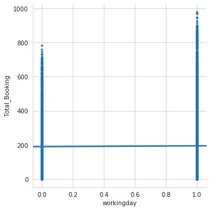

```python

import pandas as pd
import numpy as np
from datetime import datetime
from collections import defaultdict
from sklearn.preprocessing import LabelEncoder

import warnings
warnings.simplefilter(action='ignore', category=FutureWarning)
warnings.simplefilter('ignore')

import matplotlib.pyplot as plt
import matplotlib.pyplot as pl
import seaborn as sns
```


```python
train_label_df = pd.read_csv('Dataset/train_label.csv', header=None)
train_label_df.columns = ["Total_Booking"]
train_label_df.head()
#train_label_df.shape
```


<div>
<style scoped>
    .dataframe tbody tr th:only-of-type {
        vertical-align: middle;
    }

    .dataframe tbody tr th {
        vertical-align: top;
    }

    .dataframe thead th {
        text-align: right;
    }
</style>
<table border="1" class="dataframe">
  <thead>
    <tr style="text-align: right;">
      <th></th>
      <th>Total_Booking</th>
    </tr>
  </thead>
  <tbody>
    <tr>
      <th>0</th>
      <td>504</td>
    </tr>
    <tr>
      <th>1</th>
      <td>5</td>
    </tr>
    <tr>
      <th>2</th>
      <td>139</td>
    </tr>
    <tr>
      <th>3</th>
      <td>209</td>
    </tr>
    <tr>
      <th>4</th>
      <td>184</td>
    </tr>
  </tbody>
</table>
</div>


```python
train_df = pd.read_csv('Dataset/train.csv')

#split existing features into multiple features then set specific features as categorical
train_df['datetime'] = train_df['datetime'].apply(pd.to_datetime)
train_df.insert(loc=1, column='hour', value=train_df.datetime.dt.hour)
train_df.insert(loc=2, column='month', value=train_df.datetime.dt.month)
train_df.insert(loc=3, column='weekday', value=train_df.datetime.dt.weekday_name)

train_df[['hour', 'month', 'weekday', 'season', 'holiday', 'workingday', 'weather']] = train_df[['hour', 'month', 'weekday', 'season', 'holiday', 'workingday', 'weather']].astype('category')
#train_df.dtypes
#train_df.head()
#train_df.shape

```


```python
df_train = pd.concat([train_df, train_label_df], axis = 1, ignore_index=False)
df_train.head()
#df_train.shape
```


<div>
<style scoped>
    .dataframe tbody tr th:only-of-type {
        vertical-align: middle;
    }

    .dataframe tbody tr th {
        vertical-align: top;
    }

    .dataframe thead th {
        text-align: right;
    }
</style>
<table border="1" class="dataframe">
  <thead>
    <tr style="text-align: right;">
      <th></th>
      <th>datetime</th>
      <th>hour</th>
      <th>month</th>
      <th>weekday</th>
      <th>season</th>
      <th>holiday</th>
      <th>workingday</th>
      <th>weather</th>
      <th>temp</th>
      <th>atemp</th>
      <th>humidity</th>
      <th>windspeed</th>
      <th>Total_Booking</th>
    </tr>
  </thead>
  <tbody>
    <tr>
      <th>0</th>
      <td>2012-05-02 19:00:00</td>
      <td>19</td>
      <td>5</td>
      <td>Wednesday</td>
      <td>Summer</td>
      <td>0</td>
      <td>1</td>
      <td>Clear + Few clouds</td>
      <td>22.14</td>
      <td>25.760</td>
      <td>77</td>
      <td>16.9979</td>
      <td>504</td>
    </tr>
    <tr>
      <th>1</th>
      <td>2012-09-05 04:00:00</td>
      <td>4</td>
      <td>9</td>
      <td>Wednesday</td>
      <td>Fall</td>
      <td>0</td>
      <td>1</td>
      <td>Clear + Few clouds</td>
      <td>28.70</td>
      <td>33.335</td>
      <td>79</td>
      <td>19.0012</td>
      <td>5</td>
    </tr>
    <tr>
      <th>2</th>
      <td>2011-01-13 09:00:00</td>
      <td>9</td>
      <td>1</td>
      <td>Thursday</td>
      <td>Spring</td>
      <td>0</td>
      <td>1</td>
      <td>Clear + Few clouds</td>
      <td>5.74</td>
      <td>6.060</td>
      <td>50</td>
      <td>22.0028</td>
      <td>139</td>
    </tr>
    <tr>
      <th>3</th>
      <td>2011-11-18 16:00:00</td>
      <td>16</td>
      <td>11</td>
      <td>Friday</td>
      <td>Winter</td>
      <td>0</td>
      <td>1</td>
      <td>Clear + Few clouds</td>
      <td>13.94</td>
      <td>16.665</td>
      <td>29</td>
      <td>8.9981</td>
      <td>209</td>
    </tr>
    <tr>
      <th>4</th>
      <td>2011-09-13 13:00:00</td>
      <td>13</td>
      <td>9</td>
      <td>Tuesday</td>
      <td>Fall</td>
      <td>0</td>
      <td>1</td>
      <td>Clear + Few clouds</td>
      <td>30.34</td>
      <td>33.335</td>
      <td>51</td>
      <td>19.0012</td>
      <td>184</td>
    </tr>
  </tbody>
</table>
</div>


```python
df_test = pd.read_csv('Dataset/test.csv')

df_test['datetime'] = train_df['datetime'].apply(pd.to_datetime)
df_test.insert(loc=1, column='hour', value=train_df.datetime.dt.hour)
df_test.insert(loc=2, column='month', value=train_df.datetime.dt.month)
df_test.insert(loc=3, column='weekday', value=train_df.datetime.dt.weekday_name)

df_test[['hour', 'month', 'weekday', 'season', 'holiday', 'workingday', 'weather']] = df_test[['hour', 'month', 'weekday', 'season', 'holiday', 'workingday', 'weather']].astype('category')

labelencoder = LabelEncoder()

df_test['hour'] = labelencoder.fit_transform(df_test['hour'])
df_test['month'] = labelencoder.fit_transform(df_test['month'])
df_test['weekday'] = labelencoder.fit_transform(df_test['weekday'])
df_test['season'] = labelencoder.fit_transform(df_test['season'])
df_test['holiday'] = labelencoder.fit_transform(df_test['holiday'])
df_test['workingday'] = labelencoder.fit_transform(df_test['workingday'])
df_test['weather'] = labelencoder.fit_transform(df_test['weather'])

df_test.head()
#df_test.shape
```


<div>
<style scoped>
    .dataframe tbody tr th:only-of-type {
        vertical-align: middle;
    }

    .dataframe tbody tr th {
        vertical-align: top;
    }

    .dataframe thead th {
        text-align: right;
    }
</style>
<table border="1" class="dataframe">
  <thead>
    <tr style="text-align: right;">
      <th></th>
      <th>datetime</th>
      <th>hour</th>
      <th>month</th>
      <th>weekday</th>
      <th>season</th>
      <th>holiday</th>
      <th>workingday</th>
      <th>weather</th>
      <th>temp</th>
      <th>atemp</th>
      <th>humidity</th>
      <th>windspeed</th>
    </tr>
  </thead>
  <tbody>
    <tr>
      <th>0</th>
      <td>2012-05-02 19:00:00</td>
      <td>19</td>
      <td>4</td>
      <td>6</td>
      <td>2</td>
      <td>0</td>
      <td>1</td>
      <td>0</td>
      <td>21.32</td>
      <td>25.000</td>
      <td>48</td>
      <td>35.0008</td>
    </tr>
    <tr>
      <th>1</th>
      <td>2012-09-05 04:00:00</td>
      <td>4</td>
      <td>8</td>
      <td>6</td>
      <td>2</td>
      <td>0</td>
      <td>0</td>
      <td>0</td>
      <td>23.78</td>
      <td>27.275</td>
      <td>64</td>
      <td>7.0015</td>
    </tr>
    <tr>
      <th>2</th>
      <td>2011-01-13 09:00:00</td>
      <td>9</td>
      <td>0</td>
      <td>4</td>
      <td>1</td>
      <td>0</td>
      <td>0</td>
      <td>1</td>
      <td>11.48</td>
      <td>12.120</td>
      <td>100</td>
      <td>27.9993</td>
    </tr>
    <tr>
      <th>3</th>
      <td>2011-11-18 16:00:00</td>
      <td>16</td>
      <td>10</td>
      <td>0</td>
      <td>3</td>
      <td>0</td>
      <td>1</td>
      <td>2</td>
      <td>25.42</td>
      <td>28.790</td>
      <td>83</td>
      <td>0.0000</td>
    </tr>
    <tr>
      <th>4</th>
      <td>2011-09-13 13:00:00</td>
      <td>13</td>
      <td>8</td>
      <td>5</td>
      <td>2</td>
      <td>0</td>
      <td>0</td>
      <td>0</td>
      <td>25.42</td>
      <td>31.060</td>
      <td>43</td>
      <td>23.9994</td>
    </tr>
  </tbody>
</table>
</div>


```python
df_train.isnull().sum()
```


    datetime         0
    hour             0
    month            0
    weekday          0
    season           0
    holiday          0
    workingday       0
    weather          0
    temp             0
    atemp            0
    humidity         0
    windspeed        0
    Total_Booking    0
    dtype: int64


```python
test_label_df = pd.read_csv('Dataset/test_label.csv', header=None)
test_label_df.head()
```


<div>
<style scoped>
    .dataframe tbody tr th:only-of-type {
        vertical-align: middle;
    }

    .dataframe tbody tr th {
        vertical-align: top;
    }

    .dataframe thead th {
        text-align: right;
    }
</style>
<table border="1" class="dataframe">
  <thead>
    <tr style="text-align: right;">
      <th></th>
      <th>0</th>
    </tr>
  </thead>
  <tbody>
    <tr>
      <th>0</th>
      <td>256</td>
    </tr>
    <tr>
      <th>1</th>
      <td>87</td>
    </tr>
    <tr>
      <th>2</th>
      <td>11</td>
    </tr>
    <tr>
      <th>3</th>
      <td>84</td>
    </tr>
    <tr>
      <th>4</th>
      <td>668</td>
    </tr>
  </tbody>
</table>
</div>


```python
df_train.info()
```

    <class 'pandas.core.frame.DataFrame'>
    RangeIndex: 8708 entries, 0 to 8707
    Data columns (total 13 columns):
    datetime         8708 non-null datetime64[ns]
    hour             8708 non-null category
    month            8708 non-null category
    weekday          8708 non-null category
    season           8708 non-null category
    holiday          8708 non-null category
    workingday       8708 non-null category
    weather          8708 non-null category
    temp             8708 non-null float64
    atemp            8708 non-null float64
    humidity         8708 non-null int64
    windspeed        8708 non-null float64
    Total_Booking    8708 non-null int64
    dtypes: category(7), datetime64[ns](1), float64(3), int64(2)
    memory usage: 469.9 KB


```python
df_test.isnull().sum()
```


    datetime      0
    hour          0
    month         0
    weekday       0
    season        0
    holiday       0
    workingday    0
    weather       0
    temp          0
    atemp         0
    humidity      0
    windspeed     0
    dtype: int64


```python
#VISUALIZING THE DATA

plt.figure(figsize=(10,5))
sns.distplot(df_train['Total_Booking'], bins=100)
```


    <matplotlib.axes._subplots.AxesSubplot at 0x7f59b6351160>


```python
df_train.describe()['Total_Booking']
```


    count    8708.000000
    mean      193.007005
    std       181.552211
    min         1.000000
    25%        43.000000
    50%       148.000000
    75%       286.000000
    max       977.000000
    Name: Total_Booking, dtype: float64


```python
#perform label encoding on categorical features so that they can be visualized
labelencoder = LabelEncoder()

df_train['hour'] = labelencoder.fit_transform(df_train['hour'])
df_train['month'] = labelencoder.fit_transform(df_train['month'])
df_train['weekday'] = labelencoder.fit_transform(df_train['weekday'])
df_train['season'] = labelencoder.fit_transform(df_train['season'])
df_train['holiday'] = labelencoder.fit_transform(df_train['holiday'])
df_train['workingday'] = labelencoder.fit_transform(df_train['workingday'])
df_train['weather'] = labelencoder.fit_transform(df_train['weather'])

df_train.head()
```


<div>
<style scoped>
    .dataframe tbody tr th:only-of-type {
        vertical-align: middle;
    }

    .dataframe tbody tr th {
        vertical-align: top;
    }

    .dataframe thead th {
        text-align: right;
    }
</style>
<table border="1" class="dataframe">
  <thead>
    <tr style="text-align: right;">
      <th></th>
      <th>datetime</th>
      <th>hour</th>
      <th>month</th>
      <th>weekday</th>
      <th>season</th>
      <th>holiday</th>
      <th>workingday</th>
      <th>weather</th>
      <th>temp</th>
      <th>atemp</th>
      <th>humidity</th>
      <th>windspeed</th>
      <th>Total_Booking</th>
    </tr>
  </thead>
  <tbody>
    <tr>
      <th>0</th>
      <td>2012-05-02 19:00:00</td>
      <td>19</td>
      <td>4</td>
      <td>6</td>
      <td>2</td>
      <td>0</td>
      <td>1</td>
      <td>0</td>
      <td>22.14</td>
      <td>25.760</td>
      <td>77</td>
      <td>16.9979</td>
      <td>504</td>
    </tr>
    <tr>
      <th>1</th>
      <td>2012-09-05 04:00:00</td>
      <td>4</td>
      <td>8</td>
      <td>6</td>
      <td>0</td>
      <td>0</td>
      <td>1</td>
      <td>0</td>
      <td>28.70</td>
      <td>33.335</td>
      <td>79</td>
      <td>19.0012</td>
      <td>5</td>
    </tr>
    <tr>
      <th>2</th>
      <td>2011-01-13 09:00:00</td>
      <td>9</td>
      <td>0</td>
      <td>4</td>
      <td>1</td>
      <td>0</td>
      <td>1</td>
      <td>0</td>
      <td>5.74</td>
      <td>6.060</td>
      <td>50</td>
      <td>22.0028</td>
      <td>139</td>
    </tr>
    <tr>
      <th>3</th>
      <td>2011-11-18 16:00:00</td>
      <td>16</td>
      <td>10</td>
      <td>0</td>
      <td>3</td>
      <td>0</td>
      <td>1</td>
      <td>0</td>
      <td>13.94</td>
      <td>16.665</td>
      <td>29</td>
      <td>8.9981</td>
      <td>209</td>
    </tr>
    <tr>
      <th>4</th>
      <td>2011-09-13 13:00:00</td>
      <td>13</td>
      <td>8</td>
      <td>5</td>
      <td>0</td>
      <td>0</td>
      <td>1</td>
      <td>0</td>
      <td>30.34</td>
      <td>33.335</td>
      <td>51</td>
      <td>19.0012</td>
      <td>184</td>
    </tr>
  </tbody>
</table>
</div>


```python
df_train.hist(figsize=(15,20), bins=100)
plt.show()
```


```python
#OBSERVATIONS:
#Total_booking and windspeed seem to have visual correlation as do humidity and temp
#the label encoded categorical columns are visually distinct as the distribution of data is very...categorical
```


```python
total_bookings_per_annum = defaultdict(int)

for day in df_train.iterrows():
    dates = day[1][0]
    num_bookings=day[1][12]
    #add the total number of bookings to the current value for the year
    total_bookings_per_annum[dates.year] = num_bookings + total_bookings_per_annum[dates.year]
    
print(total_bookings_per_annum)
```

    defaultdict(<class 'int'>, {2012: 1059462, 2011: 621243})


```python
plt.bar(range(len(total_bookings_per_annum)), list(total_bookings_per_annum.values()), align='center')
plt.xticks(range(len(total_bookings_per_annum)), list(total_bookings_per_annum.keys()))
plt.title("Total Number of Cabs Booked per annum")
plt.show()
```


```python
daily_bookings = defaultdict(int)

for day in df_train.iterrows():
    dates = day[1][0]
    num_bookings=day[1][12]
    #add the total number of bookings to the current value for the day
    daily_bookings[dates.day] = num_bookings + daily_bookings[dates.day]

print(daily_bookings)
```

    defaultdict(<class 'int'>, {2: 83911, 5: 87773, 13: 89840, 18: 88642, 17: 92088, 6: 86512, 10: 89754, 14: 93887, 9: 91240, 19: 92258, 12: 81878, 7: 85538, 3: 88755, 4: 89366, 11: 88784, 1: 83268, 16: 89998, 15: 93583, 8: 83630})


```python
plt.bar(range(len(daily_bookings)), list(daily_bookings.values()), align='center')
plt.xticks(range(len(daily_bookings)), list(daily_bookings.keys()))
plt.title("Total Number of Cabs Booked per day")
plt.show()
```


```python
hourly_bookings = defaultdict(int)

for day in df_train.iterrows():
    dates = day[1][0]
    num_bookings=day[1][12]
    #add the total number of bookings to the current value for the hour
    hourly_bookings[dates.hour+1] = num_bookings + hourly_bookings[dates.hour+1]

print(hourly_bookings)
```

    defaultdict(<class 'int'>, {20: 115587, 5: 2208, 10: 84036, 17: 116942, 14: 97915, 18: 173281, 19: 156788, 16: 95438, 21: 83121, 15: 85972, 24: 33306, 12: 78187, 9: 127856, 2: 11975, 11: 65696, 23: 49585, 8: 77764, 3: 8361, 13: 95434, 1: 19673, 4: 4153, 6: 7052, 7: 27368, 22: 63007})


```python
plt.bar(range(len(hourly_bookings)), list(hourly_bookings.values()), align='center')
plt.xticks(range(len(hourly_bookings)), list(hourly_bookings.keys()))
plt.title("Total Number of Cabs Booked per hour")
plt.show()
```


```python
for i in df_train.columns.tolist()[1:]:
    sns.lmplot(x=i, y='Total_Booking', data=df_train, markers='.')
```





```python
#CORRELATION BETWEEN FEATURES

df_train.corr()['Total_Booking'].sort_values(ascending=False)
```


    Total_Booking    1.000000
    hour             0.399947
    temp             0.397456
    atemp            0.392754
    month            0.170355
    windspeed        0.092090
    workingday       0.012285
    holiday         -0.004391
    weekday         -0.006961
    season          -0.008503
    weather         -0.082382
    humidity        -0.307982
    Name: Total_Booking, dtype: float64


```python
plt.figure(figsize=(10, 8))
df_corr = df_train.drop('Total_Booking', axis=1).corr()
sns.heatmap(df_corr, annot=True, linewidths=0.1)
plt.show()
```


```python
#OBSERVATIONS and CONCLUSIONS:
#temp and atemp are highly correlated; need to drop one of the two 
#most features are partially correlated; can use these as independent variables.
```


```python
#PAIRPLOTS:
#pair plots are a mix of scatter plots and bar plots; can check the multicollinearity between features
#aids in visualizing ouliers in every feature
#bar plots (diagonal plots) validates the trends of feature importance as compared to plots of feature dependence

sns.pairplot(df_train)
plt.show()
```


```python
#the following pair plots plot 'Total_Booking' (dependent feature) against every independent feature for trend observation

plt.figure(figsize=(10,8))

for i in range(0, len(df_train.columns),3):
    sns.pairplot(data=df_train, x_vars=df_train.columns[i:i+2], y_vars=['Total_Booking'], height=5)
plt.show()
```


    <Figure size 720x576 with 0 Axes>


```python
#OBVERSATIONS:
#categorical features are scattered linearlly; quantitative features are scattered unpreidictibly
```


```python
#HISTOGRAMS:
#CDF plots like histograms are better for representing categorical data

sns.set_style('whitegrid')
sns.FacetGrid(df_train, hue='hour', height=7).map(sns.distplot,"Total_Booking").add_legend()
plt.title('Total_Booking vs hour')
plt.ylabel('count')
plt.show()
```


```python
sns.set_style('whitegrid')
sns.FacetGrid(df_train, hue='month', height=7).map(sns.distplot,"Total_Booking").add_legend()
plt.title('Total_Booking vs month')
plt.ylabel('count')
plt.show()
```


```python
sns.set_style('whitegrid')
sns.FacetGrid(df_train, hue='weekday', height=7).map(sns.distplot,"Total_Booking").add_legend()
plt.title('Total_Booking vs weekday')
plt.ylabel('count')
plt.show()
```


```python
sns.set_style('whitegrid')
sns.FacetGrid(df_train, hue='season', height=7).map(sns.distplot,"Total_Booking").add_legend()
plt.title('Total_Booking vs season')
plt.ylabel('count')
plt.show()
```


```python
sns.set_style('whitegrid')
sns.FacetGrid(df_train, hue='holiday', height=7).map(sns.distplot,"Total_Booking").add_legend()
plt.title('Total_Booking vs holiday')
plt.ylabel('count')
plt.show()
```


```python
sns.set_style('whitegrid')
sns.FacetGrid(df_train, hue='workingday', height=7).map(sns.distplot,"Total_Booking").add_legend()
plt.title('Total_Booking vs workingday')
plt.ylabel('count')
plt.show()
```


```python
sns.set_style('whitegrid')
sns.FacetGrid(df_train, hue='weather', height=7).map(sns.distplot,"Total_Booking").add_legend()
plt.title('Total_Booking vs weather')
plt.ylabel('count')
plt.show()
```


```python
#BOX PLOTS

sns.boxplot(x='hour',y='Total_Booking',data=df_train)
plt.title('Total_Booking vs hour')
plt.show()
```


```python
sns.boxplot(x='month',y='Total_Booking',data=df_train)
plt.title('Total_Booking vs month')
plt.show()
```


```python
sns.boxplot(x='weekday',y='Total_Booking',data=df_train)
plt.title('Total_Booking vs weekday')
plt.show()
```


```python
sns.boxplot(x='season',y='Total_Booking',data=df_train)
plt.title('Total_Booking vs season')
plt.show()
```


```python
sns.boxplot(x='holiday',y='Total_Booking',data=df_train)
plt.title('Total_Booking vs holiday')
plt.show()
```


```python
sns.boxplot(x='workingday',y='Total_Booking',data=df_train)
plt.title('Total_Booking vs workingday')
plt.show()
```


```python
sns.boxplot(x='weather',y='Total_Booking',data=df_train)
plt.title('Total_Booking vs weather')
plt.show()
```


```python
#OBSERVATION:
#points outside whiskers are outliers
```


```python
#VIOLIN PLOTS:
#similar to box plots; additional visual reinforcement for outlier analysis

sns.violinplot(x='hour',y='Total_Booking',data=df_train)
plt.title('Total_Booking vs hour')
plt.show()
```


```python
sns.violinplot(x='month',y='Total_Booking',data=df_train)
plt.title('Total_Booking vs month')
plt.show()
```


```python
sns.violinplot(x='weekday',y='Total_Booking',data=df_train)
plt.title('Total_Booking vs weekday')
plt.show()
```


```python
sns.violinplot(x='season',y='Total_Booking',data=df_train)
plt.title('Total_Booking vs season')
plt.show()
```


```python
sns.violinplot(x='holiday',y='Total_Booking',data=df_train)
plt.title('Total_Booking vs holiday')
plt.show()
```


```python
sns.violinplot(x='workingday',y='Total_Booking',data=df_train)
plt.title('Total_Booking vs workingday')
plt.show()
```


```python
sns.violinplot(x='weather',y='Total_Booking',data=df_train)
plt.title('Total_Booking vs weather')
plt.show()
```


```python
#OBSERVATIONS:
#higher density of plot points in widely spread regions; outliers lie in regions of lower plot point density ie:protruding ends
```


```python
#REMOVING OUTLIERS

df = df_train.drop('datetime', axis=1)
Q1 = df.quantile(0.25)
Q3 = df.quantile(0.75)
IQR = Q3 - Q1

df2 = df[~((df < (Q1 - 1.5 * IQR)) | (df > (Q3 + 1.5 * IQR))).any(axis=1)]
df3 = df2['Total_Booking']
df2.head()
```


<div>
<style scoped>
    .dataframe tbody tr th:only-of-type {
        vertical-align: middle;
    }

    .dataframe tbody tr th {
        vertical-align: top;
    }

    .dataframe thead th {
        text-align: right;
    }
</style>
<table border="1" class="dataframe">
  <thead>
    <tr style="text-align: right;">
      <th></th>
      <th>hour</th>
      <th>month</th>
      <th>weekday</th>
      <th>season</th>
      <th>holiday</th>
      <th>workingday</th>
      <th>weather</th>
      <th>temp</th>
      <th>atemp</th>
      <th>humidity</th>
      <th>windspeed</th>
      <th>Total_Booking</th>
    </tr>
  </thead>
  <tbody>
    <tr>
      <th>0</th>
      <td>19</td>
      <td>4</td>
      <td>6</td>
      <td>2</td>
      <td>0</td>
      <td>1</td>
      <td>0</td>
      <td>22.14</td>
      <td>25.760</td>
      <td>77</td>
      <td>16.9979</td>
      <td>504</td>
    </tr>
    <tr>
      <th>1</th>
      <td>4</td>
      <td>8</td>
      <td>6</td>
      <td>0</td>
      <td>0</td>
      <td>1</td>
      <td>0</td>
      <td>28.70</td>
      <td>33.335</td>
      <td>79</td>
      <td>19.0012</td>
      <td>5</td>
    </tr>
    <tr>
      <th>2</th>
      <td>9</td>
      <td>0</td>
      <td>4</td>
      <td>1</td>
      <td>0</td>
      <td>1</td>
      <td>0</td>
      <td>5.74</td>
      <td>6.060</td>
      <td>50</td>
      <td>22.0028</td>
      <td>139</td>
    </tr>
    <tr>
      <th>3</th>
      <td>16</td>
      <td>10</td>
      <td>0</td>
      <td>3</td>
      <td>0</td>
      <td>1</td>
      <td>0</td>
      <td>13.94</td>
      <td>16.665</td>
      <td>29</td>
      <td>8.9981</td>
      <td>209</td>
    </tr>
    <tr>
      <th>4</th>
      <td>13</td>
      <td>8</td>
      <td>5</td>
      <td>0</td>
      <td>0</td>
      <td>1</td>
      <td>0</td>
      <td>30.34</td>
      <td>33.335</td>
      <td>51</td>
      <td>19.0012</td>
      <td>184</td>
    </tr>
  </tbody>
</table>
</div>


```python
df.shape #with outliers
```


    (8708, 12)


```python
df2.shape #without outliers
```


    (8049, 12)


```python
#LEARNING MODELS

X_train = df2
X_test = df_test
y_train = df3
y_test = test_label_df
```


```python
X_train = X_train.drop('Total_Booking',axis=1)
X_train = X_train.drop('temp',axis=1) #high correlation
print(X_train.shape)
X_train.head()
```

    (8049, 10)


<div>
<style scoped>
    .dataframe tbody tr th:only-of-type {
        vertical-align: middle;
    }

    .dataframe tbody tr th {
        vertical-align: top;
    }

    .dataframe thead th {
        text-align: right;
    }
</style>
<table border="1" class="dataframe">
  <thead>
    <tr style="text-align: right;">
      <th></th>
      <th>hour</th>
      <th>month</th>
      <th>weekday</th>
      <th>season</th>
      <th>holiday</th>
      <th>workingday</th>
      <th>weather</th>
      <th>atemp</th>
      <th>humidity</th>
      <th>windspeed</th>
    </tr>
  </thead>
  <tbody>
    <tr>
      <th>0</th>
      <td>19</td>
      <td>4</td>
      <td>6</td>
      <td>2</td>
      <td>0</td>
      <td>1</td>
      <td>0</td>
      <td>25.760</td>
      <td>77</td>
      <td>16.9979</td>
    </tr>
    <tr>
      <th>1</th>
      <td>4</td>
      <td>8</td>
      <td>6</td>
      <td>0</td>
      <td>0</td>
      <td>1</td>
      <td>0</td>
      <td>33.335</td>
      <td>79</td>
      <td>19.0012</td>
    </tr>
    <tr>
      <th>2</th>
      <td>9</td>
      <td>0</td>
      <td>4</td>
      <td>1</td>
      <td>0</td>
      <td>1</td>
      <td>0</td>
      <td>6.060</td>
      <td>50</td>
      <td>22.0028</td>
    </tr>
    <tr>
      <th>3</th>
      <td>16</td>
      <td>10</td>
      <td>0</td>
      <td>3</td>
      <td>0</td>
      <td>1</td>
      <td>0</td>
      <td>16.665</td>
      <td>29</td>
      <td>8.9981</td>
    </tr>
    <tr>
      <th>4</th>
      <td>13</td>
      <td>8</td>
      <td>5</td>
      <td>0</td>
      <td>0</td>
      <td>1</td>
      <td>0</td>
      <td>33.335</td>
      <td>51</td>
      <td>19.0012</td>
    </tr>
  </tbody>
</table>
</div>


```python
X_test = X_test.drop('datetime',axis=1)
X_test = X_test.drop('temp',axis=1)
print(X_test.shape)
X_test.head()
```

    (2178, 10)


<div>
<style scoped>
    .dataframe tbody tr th:only-of-type {
        vertical-align: middle;
    }

    .dataframe tbody tr th {
        vertical-align: top;
    }

    .dataframe thead th {
        text-align: right;
    }
</style>
<table border="1" class="dataframe">
  <thead>
    <tr style="text-align: right;">
      <th></th>
      <th>hour</th>
      <th>month</th>
      <th>weekday</th>
      <th>season</th>
      <th>holiday</th>
      <th>workingday</th>
      <th>weather</th>
      <th>atemp</th>
      <th>humidity</th>
      <th>windspeed</th>
    </tr>
  </thead>
  <tbody>
    <tr>
      <th>0</th>
      <td>19</td>
      <td>4</td>
      <td>6</td>
      <td>2</td>
      <td>0</td>
      <td>1</td>
      <td>0</td>
      <td>25.000</td>
      <td>48</td>
      <td>35.0008</td>
    </tr>
    <tr>
      <th>1</th>
      <td>4</td>
      <td>8</td>
      <td>6</td>
      <td>2</td>
      <td>0</td>
      <td>0</td>
      <td>0</td>
      <td>27.275</td>
      <td>64</td>
      <td>7.0015</td>
    </tr>
    <tr>
      <th>2</th>
      <td>9</td>
      <td>0</td>
      <td>4</td>
      <td>1</td>
      <td>0</td>
      <td>0</td>
      <td>1</td>
      <td>12.120</td>
      <td>100</td>
      <td>27.9993</td>
    </tr>
    <tr>
      <th>3</th>
      <td>16</td>
      <td>10</td>
      <td>0</td>
      <td>3</td>
      <td>0</td>
      <td>1</td>
      <td>2</td>
      <td>28.790</td>
      <td>83</td>
      <td>0.0000</td>
    </tr>
    <tr>
      <th>4</th>
      <td>13</td>
      <td>8</td>
      <td>5</td>
      <td>2</td>
      <td>0</td>
      <td>0</td>
      <td>0</td>
      <td>31.060</td>
      <td>43</td>
      <td>23.9994</td>
    </tr>
  </tbody>
</table>
</div>


```python
from sklearn.preprocessing import StandardScaler

feature_scaler = StandardScaler()
X_train = feature_scaler.fit_transform(X_train)
X_test = feature_scaler.transform(X_test)
```


```python
from sklearn.linear_model import Lasso

lasso = Lasso()
lasso_model = lasso.fit(X_train, y_train)

print('Intercept:', lasso_model.intercept_)
print('coeficient:', lasso_model.coef_)

y_pred_las = lasso_model.predict(X_test)
print(y_pred_las)
```

    Intercept: 176.85700086967324
    coeficient: [ 48.75689154  13.66736039  -2.97964515  14.88212851   0.
      -3.84149703   2.36782077  51.95457614 -36.19773048   5.37765543]
    [273.96044445 156.45128178   4.32302715 ... 189.24475632 126.92906843
     205.80903076]


```python
from sklearn.metrics import mean_squared_error

rmse_las = np.sqrt(mean_squared_error(y_test,y_pred_las))
print('Lasso RMSE:', rmse_las)
```

    Lasso RMSE: 164.50591003040427


```python
x_ax = range(len(y_test))
plt.plot(x_ax, y_test, label="Original")
plt.plot(x_ax, y_pred_las, label="Predicted")
plt.title("Lasso Regression - Original and Predicted Data")
plt.legend()
plt.show()
```


```python
from sklearn.linear_model import LinearRegression

lin = LinearRegression()
lin_model = lin.fit(X_train, y_train)
print('Intercept:', lin_model.intercept_)
print('Coefficient:', lin_model.coef_)

y_pred_lin = lin_model.predict(X_test)
print(y_pred_lin)
```

    Intercept: 176.85700086967324
    Coefficient: [ 4.92221561e+01  1.40902982e+01 -3.85530859e+00  1.61788024e+01
      5.32907052e-15 -4.77110465e+00  3.85318151e+00  5.33356215e+01
     -3.73968143e+01  6.16569162e+00]
    [275.38249988 155.79976626   1.31813195 ... 189.10470512 123.0448691
     203.14596126]


```python
rmse_lin = np.sqrt(mean_squared_error(y_test,y_pred))
print('Linear Regression RMSE:',rmse_lin)
```

    Linear Regression RMSE: 164.38508055274923


```python
x_ax = range(len(y_test))
plt.plot(x_ax, y_test, label="Original")
plt.plot(x_ax, y_pred_lin, label="Predicted")
plt.title("Linear Regression - Original and Predicted Data")
plt.legend()
plt.show()
```


```python
from sklearn.tree import DecisionTreeRegressor       

dt_reg = DecisionTreeRegressor()

dt_model = dt_reg.fit(X_train, y_train)
y_pred_dt = dt_model.predict(X_test)
print(y_pred_dt)
```

    [118.  26. 157. ... 179.  93. 172.]


```python
rmse_dt = np.sqrt(mean_squared_error(y_test,y_pred_dt))
print('Decision Tree RMSE:',rmse_dt)
```

    Decision Tree RMSE: 224.2322028792493


```python
x_ax = range(len(y_test))
plt.plot(x_ax, y_test, label="Original")
plt.plot(x_ax, y_pred_dt, label="Predicted")
plt.title("Decision Tree Regression - Original and Predicted Data")
plt.legend()
plt.show()
```


```python
from sklearn.svm import SVR     

sv_reg = SVR(gamma='scale',kernel='poly')
sv_model = sv_reg.fit(X_train,y_train)
y_pred_sv = sv_model.predict(X_test)
print(y_pred_sv)
```

    [256.77160054 131.79649488 -27.9534133  ... 152.12168623 132.39201354
     158.98843248]


```python
rmse_sv = np.sqrt(mean_squared_error(y_test,y_pred_sv))
print('Support Vector RMSE:',rmse_sv)
```

    Support Vector RMSE: 170.96044542949932


```python
x_ax = range(len(y_test))
plt.plot(x_ax, y_test, label="Original")
plt.plot(x_ax, y_pred_sv, label="Predicted")
plt.title("Support Vector - Original and Predicted Data")
plt.legend()
plt.show()
```


```python
from sklearn.model_selection import GridSearchCV

svm_params = {'C':[1,3], 'epsilon':[0.1,0.5]}
svm_grid = GridSearchCV(sv_reg, svm_params, cv=10)

svm2 = svm_grid.fit(X_train, y_train)
y_pred_svm2 = svm2.predict(X_test)
print(y_pred_svm2)
```


```python
rmse_sv2 = np.sqrt(mean_squared_error(y_test,y_pred_svm2))
print('Support Vector Grid Search RMSE:',rmse_sv2)
```

    Support Vector Grid Search RMSE: 169.50002399854367


```python
svm_grid.best_params_
```


    {'C': 3, 'epsilon': 0.1}


```python
x_ax = range(len(y_test))
plt.plot(x_ax, y_test, label="Original")
plt.plot(x_ax, y_pred_svm2, label="Predicted")
plt.title("Support Vector Grid Search - Original and Predicted Data")
plt.legend()
plt.show()
```


```python
from sklearn.ensemble import RandomForestRegressor

rf_reg = RandomForestRegressor()
rf_model = rf_reg.fit(X_train,y_train)   
y_pred_rf = rf_model.predict(X_test)
print(y_pred_rf)
```

    [339.4  12.4  70.  ... 227.4 283.4 201.6]


```python
rmse_rf = np.sqrt(mean_squared_error(y_test,y_pred_rf))
print('Random Forest RMSE:',rmse_rf)
```

    Random Forest RMSE: 210.7728170071237


```python
x_ax = range(len(y_test))
plt.plot(x_ax, y_test, label="Original")
plt.plot(x_ax, y_pred_rf, label="Predicted")
plt.title("Random Forest - Original and Predicted Data")
plt.legend()
plt.show()
```


```python
from sklearn.model_selection import GridSearchCV

rf_params = {'n_estimators':[10,20,30,40], 'max_depth':[8,10,12,14], 'max_leaf_nodes':[70,90,110,130]}
rf_grid = GridSearchCV(rf_reg, rf_params, cv=10)
rf2 = rf_grid.fit(X_train, y_train)

y_pred_rf2 = rf2.predict(X_test)
print(y_pred_rf2)
```

    [407.76000197  15.20822133  82.99979995 ... 203.38050571 276.72809036
     168.25940382]


```python
rmse_rf2 = np.sqrt(mean_squared_error(y_test,y_pred_rf2))
print('Random Forest Grid Search RMSE:',rmse_rf2)
```

    Random Forest Grid Search RMSE: 209.7634530846771


```python
rf_grid.best_params_
```


    {'max_depth': 12, 'max_leaf_nodes': 130, 'n_estimators': 40}


```python
x_ax = range(len(y_test))
plt.plot(x_ax, y_test, label="Original")
plt.plot(x_ax, y_pred_rf2, label="Predicted")
plt.title("Random Forest Grid Search - Original and Predicted Data")
plt.legend()
plt.show()
```


```python
from sklearn.ensemble import AdaBoostRegressor

ab_reg = AdaBoostRegressor()
ab_model = ab_reg.fit(X_train,y_train)   
y_pred_ab = ab_model.predict(X_test)
print(y_pred_ab)
```

    [351.60211028  33.26355422 162.89010989 ... 299.4672279  242.69623329
     350.81833616]


```python
rmse_ab = np.sqrt(mean_squared_error(y_test,y_pred_ab))
print('AdaBoost RMSE:',rmse_ab)
```

    AdaBoost RMSE: 206.511892951395


```python
x_ax = range(len(y_test))
plt.plot(x_ax, y_test, label="Original")
plt.plot(x_ax, y_pred_ab, label="Predicted")
plt.title("AdaBoost - Original and Predicted Data")
plt.legend()
plt.show()
```


```python
#the following dataframe summarises the RMSEs of the various Learning ALgorithms used on the Cab Booking data

data = {'ML Models':['Lasso', 'Linear Regression', 'Decision Tree', 'SVM', 'SVM GridSearchCV', 'Random Forest', 'Random Forest GridSearchCV', 'AdaBoost'], 'RMSE':['%0.2f' %rmse_las, '%0.2f' %rmse_lin, '%0.2f' %rmse_dt, '%0.2f' %rmse_sv, '%0.2f' %rmse_sv2, '%0.2f' %rmse_rf, '%0.2f' %rmse_rf2, '%0.2f' %rmse_ab]}
results = pd.DataFrame(data)
results
```


<div>
<style scoped>
    .dataframe tbody tr th:only-of-type {
        vertical-align: middle;
    }

    .dataframe tbody tr th {
        vertical-align: top;
    }

    .dataframe thead th {
        text-align: right;
    }
</style>
<table border="1" class="dataframe">
  <thead>
    <tr style="text-align: right;">
      <th></th>
      <th>ML Models</th>
      <th>RMSE</th>
    </tr>
  </thead>
  <tbody>
    <tr>
      <th>0</th>
      <td>Lasso</td>
      <td>164.51</td>
    </tr>
    <tr>
      <th>1</th>
      <td>Linear Regression</td>
      <td>164.39</td>
    </tr>
    <tr>
      <th>2</th>
      <td>Decision Tree</td>
      <td>224.23</td>
    </tr>
    <tr>
      <th>3</th>
      <td>SVM</td>
      <td>170.96</td>
    </tr>
    <tr>
      <th>4</th>
      <td>SVM GridSearchCV</td>
      <td>169.50</td>
    </tr>
    <tr>
      <th>5</th>
      <td>Random Forest</td>
      <td>210.77</td>
    </tr>
    <tr>
      <th>6</th>
      <td>Random Forest GridSearchCV</td>
      <td>209.76</td>
    </tr>
    <tr>
      <th>7</th>
      <td>AdaBoost</td>
      <td>206.51</td>
    </tr>
  </tbody>
</table>
</div>


```python
'''
CONCLUSION:
As seen in the df above, Linear Regression (164.39) is the best ML algorithm for this cab booking examples as it has the least
RMSE which is not a hard and fast rule but certainly is an indicator of a better model

Decision trees seem to have the highest RMSE in this case, it is essentially the most inaccurate model. Not good for predicting
cab booking systems

This trend and findings correspond with the graphs generated per model, contrasting the difference in the original and predicted
data points. The graph of predicted values for Linear Regression resembles its graph of original values where as the graphs for
say Decision Trees or SVMs or Random Forests have graphs for predicted values which span all over the graph for original values,
resulting in higher inaccuracy.
'''
```


    '\nCONCLUSION:\nAs seen in the df above, Linear Regression (164.39) is the best ML algorithm for this cab booking examples as it has the least\nRMSE which is not a hard and fast rule but certainly is an indicator of a better model\n\nDecision trees seem to have the highest RMSE in this case, it is essentially the most inaccurate model. Not good for predicting\ncab booking systems\n\nThis trend and findings correspond with the graphs generated per model, contrasting the difference in the original and predicted\ndata points. The graph of predicted values for Linear Regression resembles its graph of original values where as the graphs for\nsay Decision Trees or SVMs or Random Forests have graphs for predicted values which span all over the graph for original values,\nresulting in higher inaccuracy.\n'


